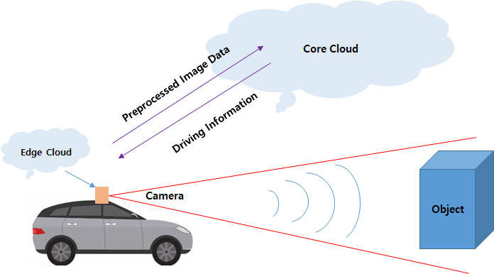

# Capstone Design2

## 자율주행 카트에서의 엣지클라우드 프로토타입 구축

카트 상의 이미지 자체를 Core Cloud서버로 전송할 경우, 네트워크 부하가 많이 발생하게 된다. 

이에따라, Cloude-Edge단에서 원본 프레임을 머신러닝 모델의 input형식에 맞추어 전처리 작업을 진행한다. 이후 전처리된 데이터만을 Core Cloud에 송신하며, Core Cloud는 사전에 로드된 머신러닝 모델을 통해 예측값을 반환한다. 이후, Edge-Cloud는 결과값만을 수신하게된다. 

이를통해 최종적으로 네트워크의 부하를 분산하여 고성능의 컴퓨팅환경을 구축하며 최종적으로 시간대비 영상 처리율 향상, 기존 연구의 병목현상 해소를 목표한다.

- 지도교수님 : 허의남

### 진행상황

---- 명패인식 모듈 ----
1. 카트에 달린 카메라에서 전처리 작업(관심영역 추출) 결과물 전송.
2. 코어클라우드에서 예측(미리 훈련된 모델 활용)
3. 예측결과 카트로 전송
4. 수신 확인, 카트의 현재위치 파악
현재 라즈베리파이 4B모델에서 초당 60프레임 이상의 성능 유지+(기존모듈의 병목현상으로 인한 프로세스 종료 현상 해결)

---- 사람인지 모듈 ----
더 높은 프레임을 유지하기위해 yolo v3모델을 에지-코어 클라우드 구조로 구현하였으나, 오히려 프레임이 떨어지는 현상이 발생.
라즈베리파이의 원본 카메라 영상을 스트리밍으로 서버에 전송, 코어클라우드에서 human prediction후 주행정보를 전송하도록 구현하였음.
